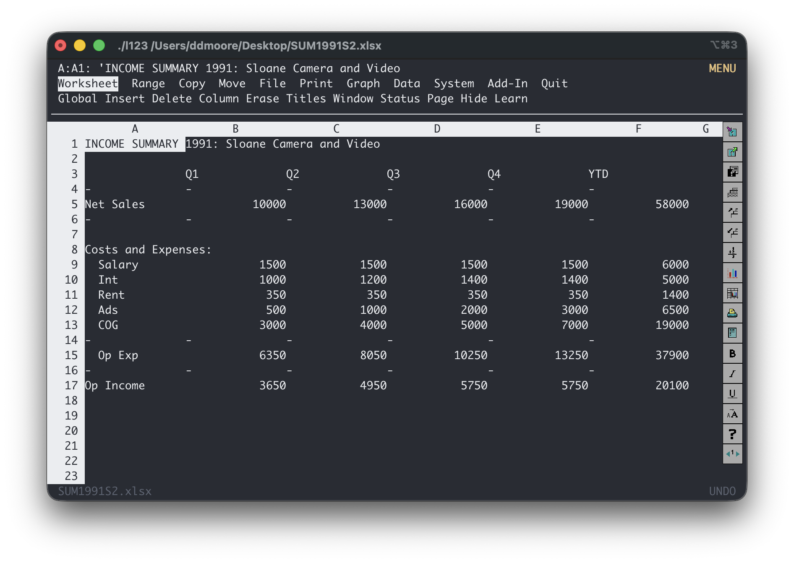

# l123

**A Lotus 1-2-3–style terminal spreadsheet with modern Excel compatibility.**

l123 recreates the classic DOS-era spreadsheet experience — slash menus,
three-line control panel, keyboard-first workflows, WYSIWYG icon panel,
and all — on top of a modern formula engine with native `.xlsx`
round-trip.

Its interaction model targets **Lotus 1-2-3 Release 3.4a for DOS**
(1993). Its compute and I/O layers are Rust, IronCalc, and UTF-8.



---

## ✦ Status

Actively developed. Tracking the milestone plan in
[`docs/PLAN.md`](docs/PLAN.md):

| Milestone | Scope | State |
|---|---|---|
| M0 | Grid, pointer nav, workspace bring-up | ✅ done |
| M1 | Control panel, modes, first-char input | ✅ done |
| M2 | Engine wire-up, formulas, recalc | ✅ done |
| M3 | Menu system and MVP slash commands | ✅ done |
| M4 | `.xlsx` and CSV round-trip | ✅ done |
| M5 | 3D sheets, GROUP, named ranges, undo | ✅ done |
| M6 | Printing (ASCII, PDF, line-printer) and Range Search | ✅ done |
| M7 | Graphs: 7 chart types, F10 view, SVG/PNG save | ✅ done |
| M8 | R3.4 WYSIWYG icon panel with mouse support | ✅ done |
| M9 | Macros: `/X`, `{BRANCH}`, `{IF}`, Learn | planned |
| M10 | Polish: startup splash, context help, themes | 🚧 in progress |

API, keybindings, and file paths may still change before v1.0.

---

## ✦ Install

Requires Rust stable (pinned via `rust-toolchain.toml`).

```bash
git clone git@github.com:duane1024/l123.git
cd l123
cargo build --release
./target/release/l123            # or: cargo run -p l123
```

Open an existing workbook:

```bash
l123 financials.xlsx
```

---

## ✦ Keyboard, the short version

The keyboard *is* the product.

| Key | What it does |
|---|---|
| `/` | Open the slash menu |
| First letter | Descend into a menu item (no `Enter` needed) |
| Arrows / `Tab` | Move pointer; during entry, commit-and-move |
| `Enter` | Commit cell entry |
| `Esc` | Back out one level (menu, prompt, POINT anchor) |
| `Ctrl-Break` | Abort to READY from anywhere |
| `.` (in POINT) | Cycle which corner of the range is anchored |
| `F1` | Context help |
| `F2` | Edit current cell |
| `F3` | List named ranges |
| `F4` | Cycle `$` absoluteness in a reference |
| `F5` | GOTO cell |
| `F9` | Recalculate |
| `F10` | Full-screen graph view |
| `Alt-F4` | Undo |
| `Ctrl-PgUp` / `Ctrl-PgDn` | Previous / next sheet |

Mouse is supported for the WYSIWYG icon panel (17 icons, R3.4a layout).

Formulas use 1-2-3 syntax: `@SUM(A1..A5)`, not `=SUM(A1:A5)`. The `@`
sigil and `..` separator are required. `#AND#`, `#OR#`, `#NOT#` are the
logical operators.

First character typed in READY decides label vs. value: digits and
`+ - . ( @ # $` start a value; anything else starts a label (with an
auto-inserted `'` prefix). `"` = right-align, `^` = center, `\-` fills the
cell with dashes.

---

## ✦ What works today

- Three-line control panel with live mode indicator
- 13 modes (READY, LABEL, VALUE, EDIT, POINT, MENU, FILES, NAMES, HELP,
  ERROR, WAIT, FIND, STAT)
- Full slash-menu tree: every path in `docs/MENU.md` is reachable; MVP
  leaves execute, non-MVP leaves show "Not implemented yet" in line 3
- `/Worksheet`, `/Range`, `/Copy`, `/Move`, `/File`, `/Quit` MVP slices
- `.xlsx` round-trip through IronCalc; `.csv` import and export
- 3D workbooks: `A..IV` sheets, `A:B3..C:D5` ranges, GROUP mode
- Named ranges, `@` function MVP set (see `docs/SPEC.md` §15)
- Command-journal undo, toggleable via `/WGD Other Undo`
- Multi-file sessions (`/File Open Before|After`, Ctrl-End navigation)
- `/Print File` to ASCII, PDF, or line-printer output; headers, footers,
  margins, page-length, formatted / unformatted / as-displayed /
  cell-formulas modes; `|` in first column hides rows from print
- `/Range Search Formulas|Labels|Both` Find and Replace
- `/Graph` tree: Line, Bar, XY, Stack, Pie, HLCO, Mixed; Titles, Legend,
  Scale, Grid, Color/B&W, Data-Labels
- F10 / `/Graph View` full-screen rendering with Unicode bar + line
  output; Kitty / iTerm2 / Sixel image support via ratatui-image
- `/Graph Save` to SVG (and plotters PNG output for all chart types)
- R3.4a WYSIWYG icon panel: all 17 icons, mouse-wired
- Startup splash screen
- Column-width options (`/WGC`, range-level set/reset)

## ✦ Coming

- Context help (F1), CRT themes, LMBCS compose key (M10, active)
- `/Data` tree: Fill, Sort, Query, Table, Distribution, Regression, Parse
- Macros: `/X`, `{BRANCH}`, `{IF}`, `{MENUBRANCH}`, `/Worksheet Learn`
- `.wk3` read-only import (values)

---

## ✦ Architecture

Rust workspace, strict layering:

```
l123-core  ← types only, zero external deps
  ↑
l123-parse, l123-menu
  ↑
l123-engine           (wraps IronCalc behind a trait)
  ↑
l123-cmd, l123-io, l123-graph, l123-print
  ↑
l123-ui               (ratatui + crossterm; engine-agnostic)
  ↑
l123                  (binary)
```

IronCalc is behind the `Engine` trait so it can be swapped. 1-2-3 formula
syntax (`@SUM`, `..`, `#AND#`) is translated to Excel syntax in
`l123-parse` before it reaches the engine. The UI never sees IronCalc
types.

---

## ✦ Authenticity contract

l123 makes two promises (`docs/SPEC.md` §1):

1. An experienced 1-2-3 R3.4a user can drive l123 cold, without reading
   anything.
2. Files round-trip cleanly to and from `.xlsx`.

SPEC §20 enumerates the behaviors — three-line control panel, menu
accelerators, POINT anchor semantics, first-char rule, `@` sigil, format
tags, commit-on-arrow, WYSIWYG icon panel, and so on — that the project
fails if it misses. Every item in the contract has at least one
acceptance transcript under `tests/acceptance/`.

---

## ✦ Development

Strict red / green / refactor. Conventions live in [`CLAUDE.md`](CLAUDE.md).

```bash
cargo test --workspace                                  # all tests
cargo test -p l123-ui --test acceptance                 # keystroke transcripts
cargo clippy --workspace --all-targets -- -D warnings   # lint
cargo fmt --all                                         # format
```

Acceptance transcripts are `.tsv` files describing keystrokes in and
screen state out; see `tests/acceptance/README.md` for the directive
syntax. Every UI-visible change lands with a transcript.

Canonical docs (treat as sources of truth):

- [`docs/SPEC.md`](docs/SPEC.md) — what l123 *is*
- [`docs/PLAN.md`](docs/PLAN.md) — milestones and risk register
- [`docs/MENU.md`](docs/MENU.md) — the complete menu tree

If code and doc disagree, fix the doc first.

---

## ✦ Non-goals

- Not a DOS emulator. No INT21h, no code pages. Strings are UTF-8.
- Not a visual homage. Functional fidelity, not CRT nostalgia. (Green /
  amber themes are a stretch goal, not the point.)
- Not a macro player for existing `.WK3` files. Read-only `.WK3` import
  is a stretch goal; write is not planned.
- Not a reimplementation of the 1-2-3 compute core. IronCalc does that.
- Not aimed at Lotus 1-2-3 for Windows or SmartSuite. Release 3.4a for
  DOS only.

---

## ✦ Philosophy

Spreadsheets didn't get worse — they just got heavier.

l123 brings back the speed, clarity, and keyboard-driven precision of
early spreadsheet software, without sacrificing compatibility with modern
workflows.

---

## ✦ Why?

Because the `/` key was never the problem.

---

## ✦ License

Licensed under the MIT License. See [`LICENSE`](LICENSE).
